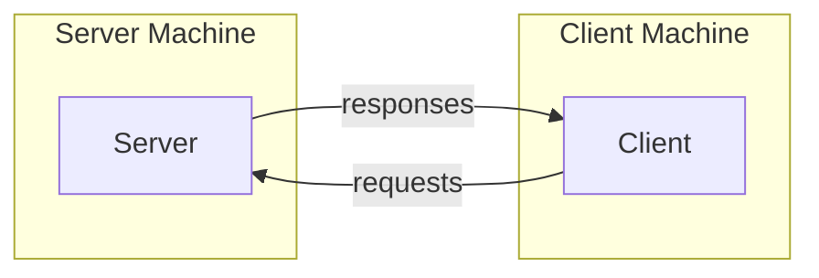

# 2-tier Architecture

The 2-tier architecture is a [client-server architecture](client-server.md), where client and server are deployed on different machines.

```mermaid
flowchart LR

subgraph Server Machine
Server[Server]
end

subgraph Client Machine
Client[Client]
end

Client--requests-->Server
Server--responses-->Client
```